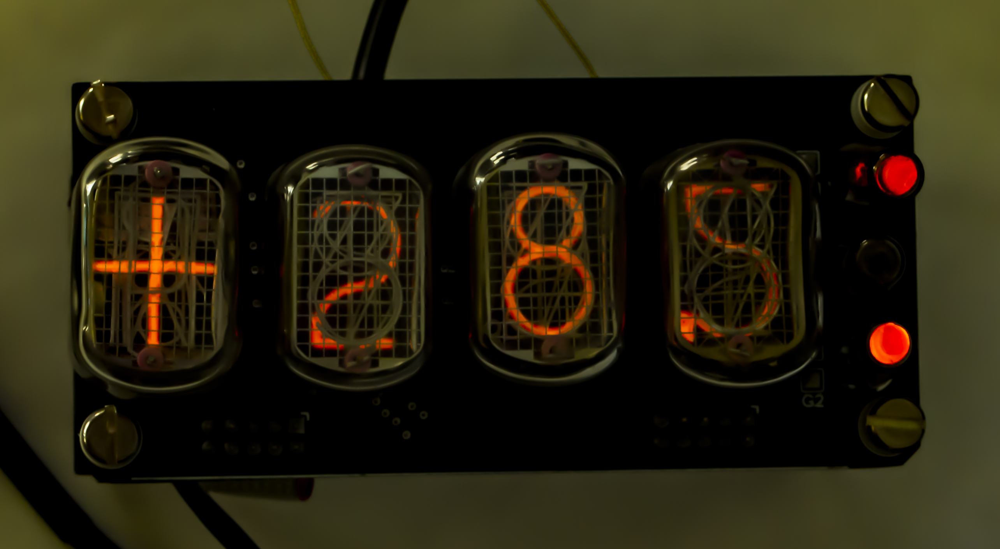

# Nixie-Weather-station

​

Погодная станция построена на индикаторах ИН-12 и ИН-15А (для точек используется ИНС-1)
Отображает температуру внутри помещения, влажность внутри помещения и температуру с выносного датчика, размещаемого на улице.
Есть возможность отображения температуры в цельсиях и фаренгейтах (фаренгейты включаются замыканием перемычки)
Связь с датчиком отображается через верхний индикатор, если он мигает медленно - нет связи, не мигает - связь установлена, мигает быстро - батарея разряжена и требует замены(зарядки)

Сборка простая, но нужно учитывать что после установки переходного разъема рядом с К155ИД1 теряется возможность прошивки ардуино через usb, прошивать либо перед установкой разъема, либо через ICSP.
Настройка заключается в установке 180В на выходе преобразователя, для измерения напряжения есть специальные контакты, подписанные +180V и земля. Настройка производится путем вращения многооборотного резистора.

ВАЖНЫЕ ЗАМЕЧАНИЯ:
1. Поскольку для преобразования 12В в 5В используется линейный стабилизатор с радиатором в виде самой платы, все это дело хорошо греется, и когда я поместил плату в закрытый корпус - плата перестала охлаждаться и тепло от нее начало доходить до датчиков температуры и влажности, внося погрешность. Поэтому если вы используете закрытый корпус то я рекомендую вместо линейного стабилизатора установить импульсный маломощный (в виде готового модуля, например Mini360), или поставить линейный, но отдельно от платы и с большим радиатором.
2. Для лучшего приема по радиоканалу к выводу антенны радиомодуля подключить кусок одножильного провода длиной 17.5 см.
3. В папке проекта есть файл со шрифтом, установите его.

